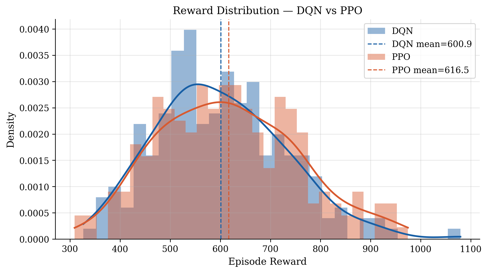

# Deep Reinforcement Learning for Dynamic Spectrum Allocation


A simulation-based research framework for intelligent wireless spectrum allocation using Deep Reinforcement Learning. Built as a PhD portfolio project demonstrating AI + telecommunications systems engineering.

---

## Overview

This project implements and compares two DRL algorithms — **DQN** and **PPO** — for dynamic spectrum allocation in a custom wireless network simulator. The environment models:

- Multi-user interference across 3 channels
- Stochastic dynamic traffic loads
- QoS-aware priority scheduling (high/low priority traffic classes)
- User mobility with distance-dependent path loss
- SINR and throughput as wireless performance metrics

---

## Project Structure

```
drl-spectrum-allocation/
│
├── env/
│   └── spectrum_env.py         # Custom Gymnasium wireless environment
│
├── train/
│   ├── train_dqn.py            # DQN training script
│   ├── train_ppo.py            # PPO training script
│   ├── baselines.py            # Random & greedy baseline evaluation
│   ├── compare_agents.py       # DQN vs PPO comparison
│   ├── throughput_analysis.py  # Throughput evaluation
│   ├── sinr_analysis.py        # SINR evaluation
│   ├── qos_analysis.py         # QoS priority analysis
│   └── mobility_analysis.py    # Distance vs SINR analysis
│
├── plots/
│   └── publication_plots.py    # All publication-quality figures
│
├── models/
│   ├── dqn_model.zip           # Trained DQN model
│   └── ppo_model.zip           # Trained PPO model
│
├── results/
│   ├── publication/            # All publication-quality PNG figures
│   └── *.csv                   # Training monitor logs
│
├── docs/
│   └── research_report.md      # IEEE-style research report
│
├── outputs/
│   └── logs/                   # TensorBoard training logs
│
├── requirements.txt
└── README.md
```

---

## Results Summary

| Method | Avg. Reward | Avg. Throughput | Avg. SINR |
|--------|-------------|-----------------|-----------|
| Random | —           | —               | —         |
| Greedy | —           | —               | —         |
| DQN    | 637.57      | 0.6619          | 3.2315    |
| PPO    | 605.43      | 0.6604          | 3.0451    |

> Random and Greedy values: run `python -m train.baselines` and fill in from terminal output.

---

## Key Figures

### Learning Curves


### Reward Distribution


### SINR vs Distance (Mobility)


### QoS Scheduling Performance


### Summary Dashboard


---

## How to Reproduce

**1. Clone the repository**
```bash
git clone https://github.com/Ibukunoluwa-Adeshina/drl-spectrum-allocation.git
cd drl-spectrum-allocation
```

**2. Create and activate virtual environment**
```bash
python -m venv venv
venv\Scripts\activate        # Windows
source venv/bin/activate     # macOS/Linux
```

**3. Install dependencies**
```bash
pip install -r requirements.txt
```

**4. Train the agents**
```bash
python -m train.train_dqn
python -m train.train_ppo
```

**5. Run evaluation and plots**
```bash
python -m train.baselines
python -m train.compare_agents
python -m plots.publication_plots
```

**6. View TensorBoard logs**
```bash
tensorboard --logdir outputs/logs
```
Then open `http://localhost:6006` in your browser.

---

## Research Report

A full IEEE-style research report covering system model, mathematical formulation, experimental setup, and results discussion is available in [`docs/research_report.md`](docs/research_report.md).

---

## Technologies Used

| Category       | Tools                            |
|----------------|----------------------------------|
| Language       | Python 3.10+                     |
| RL Framework   | Stable-Baselines3 (DQN, PPO)     |
| Environment    | OpenAI Gymnasium                 |
| Deep Learning  | PyTorch                          |
| Visualisation  | Matplotlib                       |
| Experiment Log | TensorBoard                      |

---

## Author

**Ibukunoluwa Sunday Adeshina**  
Telecommunications Engineering | AI + Wireless Networks Research  
[GitHub](https://github.com/Ibukunoluwa-Adeshina)

---

## License

MIT License — free to use and adapt with attribution.
