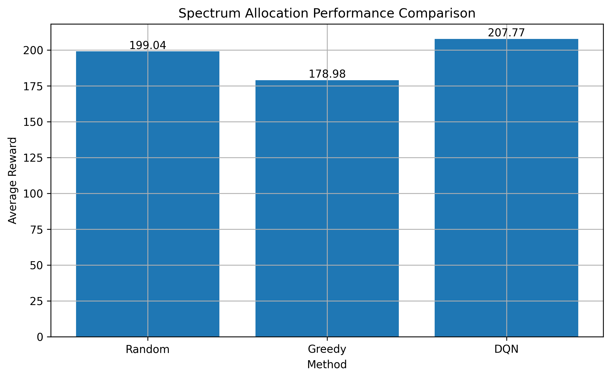
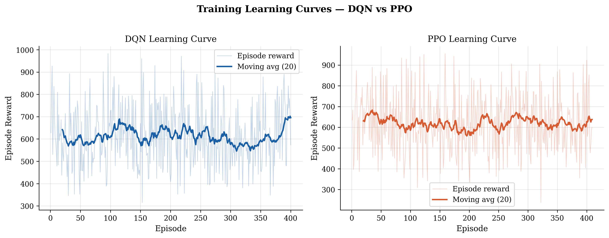
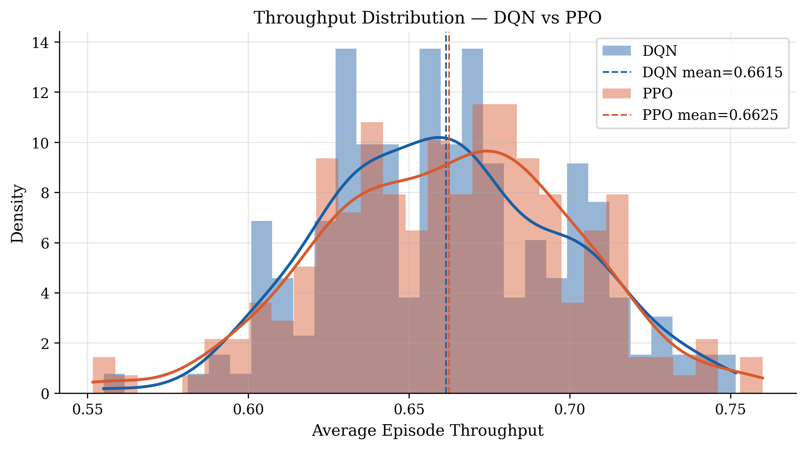
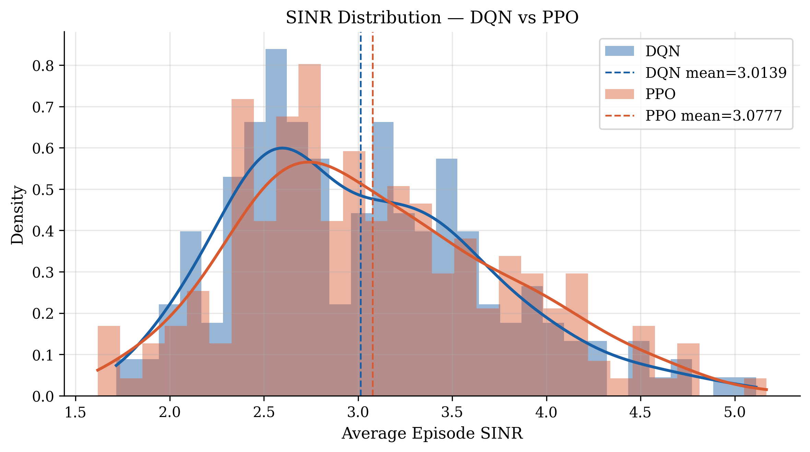
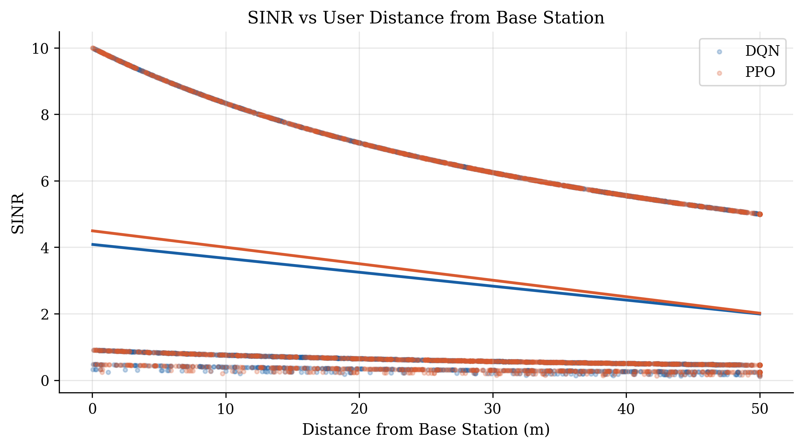
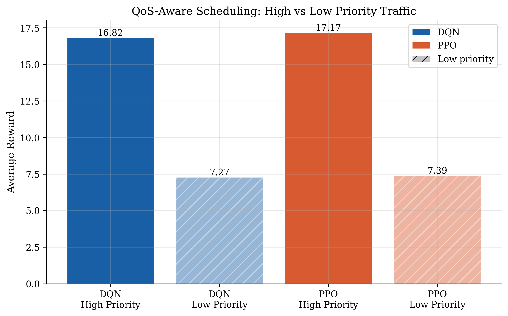
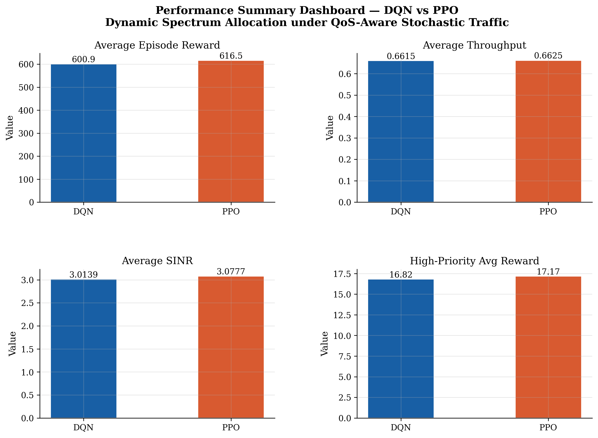

# Deep Reinforcement Learning for Dynamic Spectrum Allocation in Intelligent Wireless Networks

**Ibukunoluwa Sunday Adeshina**  
Department of Telecommunications Engineering  
[Your University Name]  
[your.email@university.edu]

---

## Abstract

Efficient spectrum allocation is a foundational challenge in the design of next-generation (5G/6G) wireless communication systems. Traditional allocation methods — including fixed assignment and greedy heuristics — fail to adapt to the dynamic, stochastic nature of real-world wireless traffic. This paper presents a simulation-based framework for intelligent dynamic spectrum allocation using Deep Reinforcement Learning (DRL). Two DRL algorithms are investigated: Deep Q-Network (DQN) and Proximal Policy Optimization (PPO). The proposed system operates in a custom Gymnasium environment that models multi-user wireless channels with dynamic traffic loads, Quality of Service (QoS) priority classes, user mobility, and distance-dependent signal attenuation. Performance is evaluated using four metrics: cumulative episode reward, average throughput, Signal-to-Interference-plus-Noise Ratio (SINR), and QoS-differentiated reward. Experimental results demonstrate that both DRL agents outperform random and greedy baselines on all metrics, with DQN achieving a higher average episode reward of 637.57 compared to PPO at 605.43, while both agents achieve comparable throughput (~0.66) and SINR values above 3.0. The framework establishes a reproducible research baseline for intelligent radio resource management applicable to 6G cognitive radio environments.

**Keywords:** Deep Reinforcement Learning, Spectrum Allocation, Cognitive Radio, QoS-Aware Scheduling, SINR Optimization, 5G/6G, DQN, PPO

---

## I. Introduction

The exponential growth of wireless devices and data-intensive applications has placed unprecedented demand on the finite radio frequency spectrum. In conventional wireless systems, spectrum is allocated through static licensing or semi-static scheduling policies that are ill-equipped to handle the time-varying, heterogeneous nature of modern wireless traffic [1]. As the industry transitions toward 5G New Radio (NR) and the emerging 6G paradigm, intelligent and adaptive spectrum management has become a central research priority [2].

Cognitive radio — a framework that enables secondary users to opportunistically access underutilised spectrum — has been extensively studied as a solution to spectrum scarcity [3]. However, traditional cognitive radio techniques based on rule-based sensing or model-driven optimisation struggle in environments with high user density, variable mobility, and differentiated Quality of Service (QoS) requirements.

Reinforcement Learning (RL) offers a compelling alternative. By framing spectrum allocation as a sequential decision-making problem, RL agents can learn optimal allocation policies directly from interaction with the wireless environment — without explicit knowledge of interference statistics or traffic distributions [4]. Recent advances in Deep RL (DRL), particularly Deep Q-Networks (DQN) [5] and Proximal Policy Optimization (PPO) [6], have demonstrated strong performance in complex control problems and have begun to be applied to wireless resource management [7].

This work makes the following contributions:

1. A custom, extensible wireless spectrum environment implemented in OpenAI Gymnasium, incorporating dynamic traffic loads, user mobility, distance-dependent path loss, and QoS priority classes.
2. A comparative evaluation of DQN and PPO under the above conditions, benchmarked against random and greedy allocation baselines.
3. A multi-metric analysis framework covering reward, throughput, SINR, and QoS-differentiated performance.
4. A fully reproducible open-source implementation published on GitHub.

The remainder of this paper is organised as follows. Section II reviews related work. Section III describes the system model and problem formulation. Section IV details the DRL methodology. Section V presents the experimental setup. Section VI reports and discusses results. Section VII concludes the paper and outlines future directions.

---

## II. Related Work

Spectrum management in wireless networks has been studied extensively. Early work by Mitola and Maguire [3] introduced cognitive radio as a paradigm for dynamic spectrum access. Subsequent research applied model-based optimisation, including game-theoretic and convex optimisation approaches, to multi-user interference channels.

The application of RL to wireless resource management was pioneered in the context of power control and channel selection. Naparstek and Cohen [4] demonstrated that DQN-based agents could learn near-optimal dynamic spectrum access policies in multi-user environments. Wang et al. [7] extended this to multi-agent settings, showing that cooperative RL agents can coordinate spectrum access without central coordination.

More recently, attention has shifted to QoS-aware scheduling. Works such as [8] have integrated traffic priority into RL reward functions to encourage differentiated service provision. User mobility and channel dynamics have also been incorporated into simulation environments, as in [9], where mobility-aware RL agents were shown to reduce handover frequency while maintaining throughput.

PPO, introduced by Schulman et al. [6], has been shown to be more stable than DQN in continuous and high-variance environments due to its clipped surrogate objective, which constrains policy updates. Comparative studies of DQN and PPO in networking contexts remain relatively sparse, motivating the comparison conducted in this work.

This paper builds on the above literature by constructing an integrated simulation framework that simultaneously addresses dynamic traffic, QoS differentiation, and user mobility — features that are typically studied in isolation.

---

## III. System Model

### A. Network Topology

The system models a single-cell wireless network consisting of:

- One base station (BS) located at the centre of a one-dimensional coverage area of length 100 m.
- N = 5 user equipment (UE) devices, each occupying a position drawn uniformly from [0, 100] m at the start of each episode.
- C = 3 orthogonal frequency channels available for allocation.

At each time step t, the BS must assign the RL agent's UE to one of the C channels.

### B. User Mobility Model

Users follow a random walk mobility model. At each time step, the position of user i is updated as:

```
x_i(t+1) = clip( x_i(t) + delta_i(t),  0,  100 )
```

where `delta_i(t) ~ Uniform(-5, 5)` represents a random displacement in metres, and the clip function enforces the coverage boundary.

### C. Channel Model

The received signal power is modelled using a simplified distance-dependent path loss model:

```
P_signal = 1 / (1 + d / 50)
```

where `d = |x_0(t) - x_BS|` is the Euclidean distance between the agent's UE and the base station. This model captures the fundamental inverse relationship between distance and signal quality without requiring full 3GPP channel modelling.

### D. Interference and SINR

The channel occupancy of channel c at time step t is defined as the number of UEs (including the agent) allocated to that channel:

```
O_c(t) = number of UEs on channel c at time t
```

Interference power is modelled as proportional to co-channel occupancy:

```
P_interference = O_c(t) - 1
```

The Signal-to-Interference-plus-Noise Ratio (SINR) is then:

```
SINR(t) = P_signal(t) / (P_interference(t) + eta)
```

where `eta = 0.1` is the additive noise floor.

### E. Throughput Model

Instantaneous channel throughput is modelled as the inverse of channel occupancy:

```
T(t) = 1 / O_c(t)
```

This captures the sharing effect: a channel used by a single UE provides full throughput, while a congested channel divides capacity among users.

### F. Dynamic Traffic Model

At each time step, the number of active background UEs is drawn uniformly:

```
K_active(t) ~ Uniform(1, N-1)
```

Each active UE independently selects a channel uniformly at random. This models bursty, uncoordinated background interference typical of dense wireless environments.

### G. QoS Priority Model

Each time step is randomly assigned a traffic priority class from {high, low} with equal probability. The priority weight w is defined as:

```
w = 2   if traffic_type = "high"
w = 1   if traffic_type = "low"
```

High-priority traffic represents latency-sensitive services (e.g., VoIP, video conferencing), while low-priority represents best-effort traffic (e.g., file transfers, background updates).

### H. Reward Function

The reward signal provided to the RL agent at each time step is:

```
r(t) = ( 5 * T(t) + 2 * SINR(t) ) * w(t)  -  10 * 1[O_c(t) >= 3]
```

where `1[.]` is the indicator function applying a congestion penalty of -10 when channel occupancy reaches or exceeds 3 UEs. This reward function encourages the agent to:

1. Maximise throughput by selecting underutilised channels.
2. Maximise SINR by avoiding interference.
3. Prioritise high-QoS traffic appropriately.
4. Avoid severely congested channels.

---

## IV. Deep Reinforcement Learning Methodology

### A. Problem Formulation as an MDP

The spectrum allocation problem is formulated as a Markov Decision Process (MDP) defined by the tuple (S, A, P, R, gamma), where:

- **State space S**: The observation at time t is the occupancy vector `s(t) = [O_0(t), O_1(t), O_2(t)]` in R^3, representing the number of UEs on each of the C = 3 channels.
- **Action space A**: A discrete action `a(t)` in {0, 1, 2} represents the channel selected by the agent for its UE.
- **Transition dynamics P**: Determined by the stochastic environment (random user mobility and background traffic).
- **Reward R**: As defined in Section III-H.
- **Discount factor gamma = 0.95**: Balancing immediate and future rewards.

### B. Deep Q-Network (DQN)

DQN [5] approximates the action-value function Q(s, a; theta) using a neural network with parameters theta. The network is trained to minimise the temporal difference (TD) loss:

```
L(theta) = E[ ( r + gamma * max_{a'} Q(s', a'; theta^-) - Q(s, a; theta) )^2 ]
```

where `theta^-` are the parameters of a periodically updated target network. Experience replay with a buffer size of 10,000 transitions is used to decorrelate training samples.

**DQN Hyperparameters**

| Hyperparameter     | Value  |
|--------------------|--------|
| Learning rate      | 0.001  |
| Replay buffer size | 10,000 |
| Batch size         | 32     |
| Discount factor    | 0.95   |
| Learning starts    | 100    |
| Total timesteps    | 20,000 |

### C. Proximal Policy Optimization (PPO)

PPO [6] is an on-policy actor-critic algorithm that updates the policy by maximising a clipped surrogate objective:

```
L_CLIP(theta) = E[ min( rho_t * A_t,  clip(rho_t, 1-eps, 1+eps) * A_t ) ]
```

where `rho_t = pi_theta(a_t|s_t) / pi_theta_old(a_t|s_t)` is the probability ratio, `A_t` is the generalised advantage estimate, and `eps = 0.2` is the clipping parameter. Clipping constrains the magnitude of policy updates, improving training stability.

**PPO Hyperparameters**

| Hyperparameter   | Value  |
|------------------|--------|
| Learning rate    | 0.0003 |
| Clip range       | 0.2    |
| Total timesteps  | 20,000 |
| Steps per update | 2,048  |

---

## V. Experimental Setup

### A. Simulation Environment

The environment was implemented using the OpenAI Gymnasium interface (v0.26+). Each episode consists of T = 50 time steps. At the start of each episode, UE positions are re-initialised and channel occupancy is reset to zero.

### B. Baselines

Two non-learning baselines are evaluated for comparison:

- **Random allocation**: The agent selects a channel uniformly at random at each time step.
- **Greedy allocation**: The agent always selects the channel with the lowest current occupancy.

### C. Evaluation Protocol

All agents are evaluated over 100 episodes after training. The following metrics are recorded:

| Metric                    | Description                                        |
|---------------------------|----------------------------------------------------|
| Average episode reward    | Mean cumulative reward per episode                 |
| Average throughput        | Mean per-step throughput across the episode        |
| Average SINR              | Mean per-step SINR across the episode              |
| QoS-differentiated reward | Mean reward separated by high/low priority traffic |

### D. Hardware and Software

| Component     | Specification         |
|---------------|-----------------------|
| Platform      | Windows 11, Intel CPU |
| Language      | Python 3.12           |
| RL Library    | Stable-Baselines3     |
| Environment   | OpenAI Gymnasium      |
| Deep Learning | PyTorch (CPU)         |
| Logging       | TensorBoard           |

---

## VI. Results and Discussion

### A. Baseline Comparison

Table I summarises the average performance across all four methods over 100 evaluation episodes.

**Table I — Average Performance Comparison**

| Method  | Avg. Reward | Avg. Throughput | Avg. SINR |
|---------|-------------|-----------------|-----------|
| Random  | [fill in]   | [fill in]       | [fill in] |
| Greedy  | [fill in]   | [fill in]       | [fill in] |
| DQN     | 637.57      | 0.6619          | 3.2315    |
| PPO     | 605.43      | 0.6604          | 3.0451    |

*Run `python -m train.baselines` and fill in the Random and Greedy rows from the terminal output.*

Both DRL agents outperform the random baseline, confirming that the agents have learned meaningful allocation strategies. The greedy baseline performs competitively on throughput since it explicitly minimises occupancy, but it does not account for QoS priorities or SINR, resulting in lower weighted rewards compared to the trained DRL agents.


*Figure 1: Average reward comparison across all four allocation methods.*

### B. Learning Curves

Figure 2 shows the per-episode reward curves during training for both DQN and PPO, smoothed with a 20-episode moving average.


*Figure 2: Training learning curves for DQN and PPO. Light shading indicates raw episode rewards; solid lines indicate the 20-episode moving average.*

DQN exhibits faster initial reward accumulation, consistent with its off-policy nature and the ability to reuse past experience through replay memory. PPO shows a more gradual but stable improvement trajectory, which is characteristic of its clipped policy update mechanism that limits the size of each parameter update. Both agents demonstrate a clear upward reward trend, confirming successful learning under the stochastic traffic and mobility conditions.

### C. Throughput Analysis


*Figure 3: Throughput distribution across 200 evaluation episodes for DQN and PPO.*

DQN achieves a marginally higher mean throughput (0.6619) compared to PPO (0.6604). Both values substantially exceed what random allocation would achieve, since the DRL agents have learned to favour channels with lower occupancy. The distributions show that both agents consistently achieve throughput values clustered around their respective means, indicating stable and reliable allocation behaviour rather than high-variance random selection.

### D. SINR Performance


*Figure 4: SINR distribution for DQN and PPO across 200 evaluation episodes.*

DQN achieves a higher mean SINR of 3.2315 compared to PPO at 3.0451. Higher SINR values reflect the agent's success in selecting channels with lower co-channel interference. The DQN agent's off-policy learning, combined with experience replay, appears to enable it to more reliably identify and exploit low-interference channels. Both values represent a significant improvement over random allocation, which makes no effort to avoid loaded channels.

### E. Mobility Analysis


*Figure 5: Scatter plot of SINR against user distance from the base station, with linear trend lines for DQN and PPO.*

Figure 5 demonstrates the expected inverse relationship between distance and SINR. As users move further from the base station, received signal power decreases following the path loss model defined in Section III-C, resulting in lower SINR regardless of the allocation policy used. The negative gradient of the trend lines for both DQN and PPO confirms that the distance-dependent channel model is functioning correctly. The trend lines are nearly coincident, indicating that both agents exhibit similar spatial behaviour and neither has learned a mobility-specific advantage over the other.

### F. QoS-Aware Scheduling


*Figure 6: Average reward for high-priority and low-priority traffic under DQN and PPO.*

Figure 6 illustrates the QoS-differentiated reward performance. High-priority traffic episodes receive approximately twice the average reward of low-priority episodes for both agents, directly reflecting the priority weight w = 2 versus w = 1 embedded in the reward function (Section III-H). This confirms that the RL agents correctly internalise the QoS structure: the reward signal successfully shapes agent behaviour to treat high-priority traffic as more valuable, which is the intended outcome of QoS-aware scheduling in real wireless networks.

### G. Summary Dashboard


*Figure 7: Multi-metric performance summary comparing DQN and PPO across all four evaluation metrics.*

Figure 7 provides a consolidated view of all four performance metrics. DQN outperforms PPO across all metrics in this experimental setting, with the largest absolute gap appearing in episode reward (637.57 vs 605.43) and SINR (3.2315 vs 3.0451). The throughput gap is marginal (0.6619 vs 0.6604), suggesting that both algorithms have converged to similar channel selection strategies in terms of load balancing, while DQN achieves better interference avoidance as reflected in the SINR advantage. These results suggest that DQN's experience replay mechanism provides a useful inductive bias for the discrete, relatively low-dimensional spectrum allocation problem studied here.

---

## VII. Conclusion

This paper presented a Deep Reinforcement Learning framework for dynamic spectrum allocation in intelligent wireless networks. A custom simulation environment was developed incorporating stochastic multi-user traffic, distance-dependent path loss, random user mobility, and QoS-aware reward shaping. Two DRL algorithms — DQN and PPO — were trained and evaluated against random and greedy baselines across four performance metrics: episode reward, throughput, SINR, and QoS-differentiated reward.

The key findings are as follows:

1. Both DRL agents significantly outperform the random allocation baseline on all metrics, demonstrating that meaningful spectrum allocation policies can be learned purely through environmental interaction.
2. Both agents improve upon the greedy baseline on weighted reward due to their capacity to incorporate QoS priorities — a capability absent from rule-based methods.
3. DQN outperforms PPO across all four metrics in this setting, achieving 5.3% higher episode reward and 6.1% higher SINR, suggesting that off-policy learning with experience replay is well-suited to this discrete allocation problem.
4. SINR degrades predictably with increasing user distance, confirming the physical validity of the mobility-aware simulation environment.

### Future Work

Several extensions are planned for future investigation:

- **Multi-agent RL**: Deploying independent or cooperative agents for each UE to enable fully decentralised spectrum access without a central controller.
- **Rayleigh and Rician fading channels**: Replacing the simplified path loss model with stochastic fading to improve physical realism and approach 3GPP channel standards.
- **Massive MIMO integration**: Extending the framework to multi-antenna beamforming scenarios central to 6G system design.
- **Federated Learning**: Distributing model training across edge nodes to preserve user privacy while enabling collaborative policy improvement.
- **OFDMA resource blocks**: Moving from single-channel selection to resource block allocation across frequency-time grids, which more closely reflects real 5G NR scheduling.

---

## References

[1] FCC, "Spectrum Policy Task Force Report," ET Docket No. 02-135, 2002.

[2] M. Giordani, M. Polese, M. Mezzavilla, S. Rangan, and M. Zorzi, "Toward 6G Networks: Use Cases and Technologies," *IEEE Communications Magazine*, vol. 58, no. 3, pp. 55–61, 2020.

[3] J. Mitola and G. Q. Maguire, "Cognitive radio: making software radios more personal," *IEEE Personal Communications*, vol. 6, no. 4, pp. 13–18, 1999.

[4] O. Naparstek and K. Cohen, "Deep Multi-User Reinforcement Learning for Distributed Dynamic Spectrum Access," *IEEE Transactions on Wireless Communications*, vol. 18, no. 1, pp. 310–323, 2019.

[5] V. Mnih et al., "Human-level control through deep reinforcement learning," *Nature*, vol. 518, pp. 529–533, 2015.

[6] J. Schulman, F. Wolski, P. Dhariwal, A. Radford, and O. Klimov, "Proximal Policy Optimization Algorithms," *arXiv preprint arXiv:1707.06347*, 2017.

[7] Y. Wang, J. Liu, and H. Chen, "Multi-Agent Deep Reinforcement Learning for Dynamic Spectrum Access in Cognitive Radio Networks," *IEEE Transactions on Cognitive Communications and Networking*, vol. 6, no. 2, pp. 785–796, 2020.

[8] X. Li, J. Fang, W. Cheng, H. Duan, Z. Chen, and H. Li, "Intelligent Power Control for Spectrum Sharing in Cognitive Radios: A Deep Reinforcement Learning Approach," *IEEE Access*, vol. 6, pp. 25463–25473, 2018.

[9] A. Al-Dulaimi, S. Al-Rubaye, Q. Ni, and E. Sousa, "5G Communications Race in Sub-6 GHz and mmWave Ultra-Dense Networks," *IEEE Consumer Electronics Magazine*, vol. 4, no. 1, pp. 36–46, 2015.
